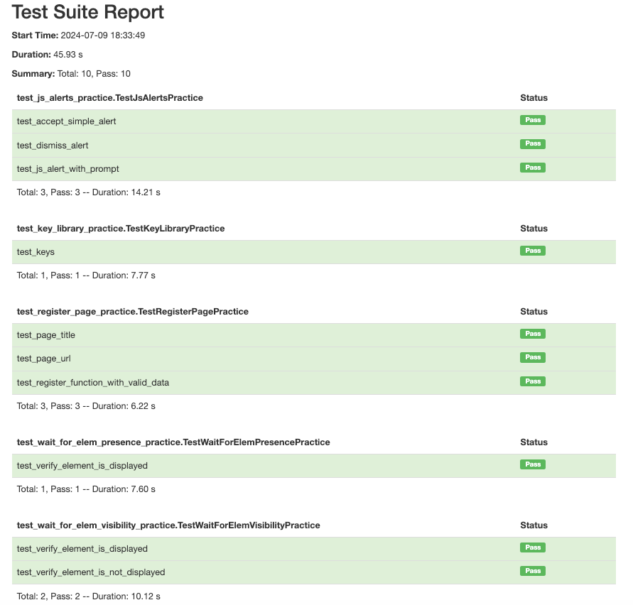

## Title: Test suite testing using unitest framework.
## Installation:
-> Install python and pycharm
-> import unitest
-> Use the package manager to install:
- pip install -U selenium
- pip install html-testRunner -> generate the html report

## Description:
-> The purpose of this mini project is to add multiple test cases to a TestSuite and run them
-> We will be working with Unitest framework

## Project Structure
-> There are 5 directories, each one including a class with multiple tcs , SetUp, TearDown methods.
-> One directory is created to host all TCs into one Test Suite

## Utilization 
-> The tests contains JS alerts, key library, wait for elemenent presence and wait for element visibility, register page
-> All of them are created for practicing purpose

## How to run and generate the report
-> Go to test_suite.py and click on Green arrow in front of TestSuite class and you can find the report inside reports directory

### Report:

