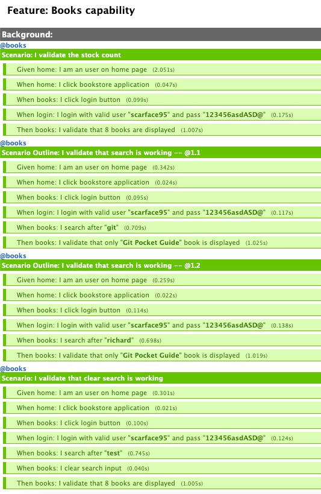
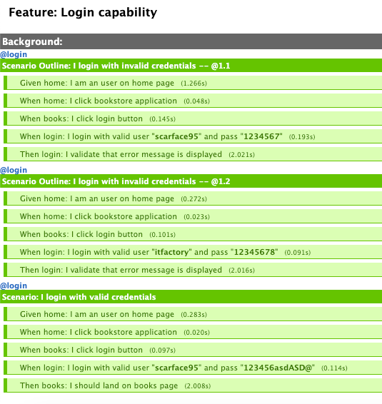

## Title: DemoQA Test Automation project with bdd framework.
## Installation:
-> Install python and pycharm
-> Use the package manager pip to install selenium and behave framework
- pip install -U selenium
- pip install behave
- pip install behave-html-formatter 

## Description:
-> The purpose of this project is test in an automation manner this site https://demoqa.com/ 
for different capabilities such as login with valid/invalid credentials, check the books availability

-> We will be working with Behave Framework and Page Object Model design pattern

## Project Structure
-> Features directory where tests are mapped in english language

-> Pages directory where are written methods for actions and verifications 

-> Steps directory where is linked the features directory and pages directory

## Utilization 
-> There are 2 features: one for login and one for books
-> For running the TCs we have to use tags (books, login)

## How to run and generate the report
-> behave -f html -o choose_name.html --tags=choose_tag

### Feature: Books capability report

### Feature: Login capability report

